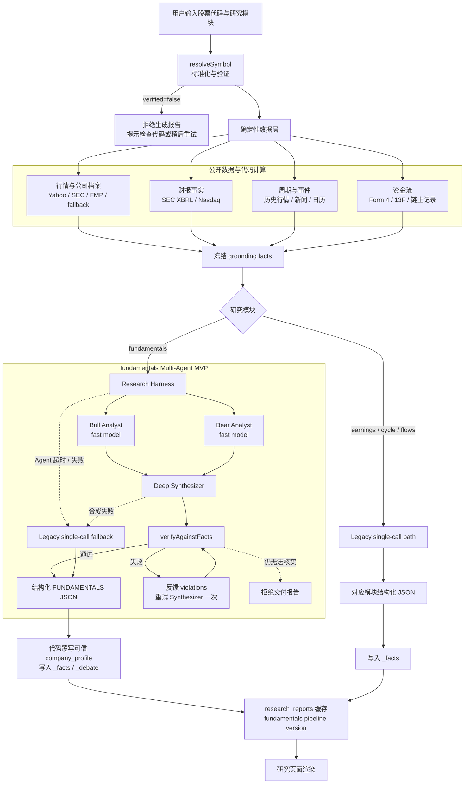
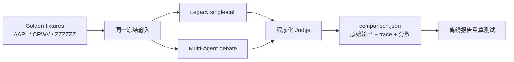

# Helix Trading

Helix Trading 是一个面向交易决策辅助的研究与纪律工具。它不下单、不代客理财，也不输出买卖建议。系统把公开市场数据、结构化研究和可验证的 AI 分析放在同一条工作流中。

当前 MVP 的重点是：在 `fundamentals` 研究模块中，把原来的单模型调用升级为可观测、可回退、可评测的 Bull / Bear 多 Agent Harness。

## 产品壁垒

Helix Trading 不以“生成更多投资观点”为核心差异，而是把研究过程做成可验证、可追溯、可回放的证据链。研究页会直接展示事实与推演数量、已标注来源、Verifier 检查结果、Bull/Bear Agent 状态、耗时和 fallback 原因。用户能够判断报告采用了哪条研究路径，以及系统何时因为数据或 Agent 故障进行了安全降级。

这套可信研究层由四部分组成：确定性数据 grounding、事实/推演分离、程序化事实校验、完整执行 trace。即使替换底层模型，证据合同、失败处理、评测数据和回放能力仍可保留。

## 技术栈

- React 19 + TanStack Start / Router + TypeScript
- Tailwind CSS v4 + Vite
- Supabase Postgres / Auth / RLS
- OpenAI-compatible AI gateway，支持 fast / deep 两档模型
- Vitest + ESLint + TypeScript 工程门禁

## 当前架构



### 线上请求路径说明

1. `resolveSymbol()` 先标准化并验证代码。无法确认的标的不进入 AI 生成路径。
2. 服务端并行拉取公开数据，并把可计算的硬数据放入同一份 grounding。代码负责数字计算，AI 负责解释。
3. `fundamentals` 走 Bull / Bear → Synthesizer → Verifier；Bull 和 Bear 使用 fast model 并行执行，Synthesizer 使用 deep model。
4. Verifier 目前重点检查 `kind: "fact"` 中的数字和日期是否能在 grounding 中找到。失败时反馈具体违规项，最多重试一次。
5. 任一分析 Agent 超时或失败、Synthesizer 失败时回到旧的单模型路径。最终输出仍无法核实时，拒绝交付报告。
6. 输出保留 `_facts`、`_debate`、Agent 状态、耗时、fallback 原因和验证结果，方便复现问题。

## Harness 与评测



当前冻结样本：

- `AAPL`：数据较完整
- `CRWV`：档案较薄
- `ZZZZZZ`：无效代码，验证拒绝路径
- AAPL 与 CRWV 的 `employees` 被刻意置为 `null`，作为 known trap

当前 Judge 只衡量数字/日期事实接地率和空值陷阱，不评价语义事实、来源真实性、辩论质量或成本。最新同快照结果：

| 标的 | 单调用 | Multi-Agent | 陷阱编造 | 结论 |
| --- | ---: | ---: | --- | --- |
| AAPL | 10/10 | 8/8 | 均未编造 | 小样本，不能证明优劣 |
| CRWV | 1/1 | 2/2 | 均未编造 | 论点偏通用，信息增量有限 |
| ZZZZZZ | 拒绝 | 拒绝 | 不适用 | 验证路径符合预期 |

原始输出与 Agent trace 见 [`eval/reports/comparison.json`](eval/reports/comparison.json)，人工复核见 [`docs/mvp-eval-summary.md`](docs/mvp-eval-summary.md)。

## 本地开发与验证

```bash
npm install
npm run dev
```

提交 Harness 或研究工作流变更前运行：

```bash
npm run verify
npm run build
```

`npm run verify` 当前包含 Harness 定向 lint、TypeScript 检查和 Vitest。在线评测为显式 opt-in：

```bash
# 使用 .env.local 和外部公开数据源录制冻结 fixture
npm run eval:record

# 使用已配置 AI gateway，对同一冻结输入跑单调用与 Multi-Agent
npm run eval:live
```

在线评测可能产生外部 API 请求和模型成本，默认 `npm test` 不会调用它们。

## 当前范围与后续展望

当前 MVP 已完成 `fundamentals` 的多 Agent 编排、fallback、Verifier 重试/拒绝、缓存版本隔离、冻结输入对照和报告重算测试。以下内容明确属于后续展望：

1. 扩充 Golden Dataset，并接入 CI 回归门禁和阈值比较。
2. 增加 semantic Judge、来源 attribution 检查、成本与延迟监控。
3. 在评测证明收益后，再评估 `earnings` 的 Multi-Agent 改造。
4. 将宏观简报的 News Scout → Impact Analyst → Strategist → Compliance Reviewer 作为可选 Phase 3。

当前没有证据证明 Multi-Agent 已经优于单模型；MVP 的交付价值是把研究 Agent 变成可编排、可回退、可验证、可测试和可复核的工作流。
